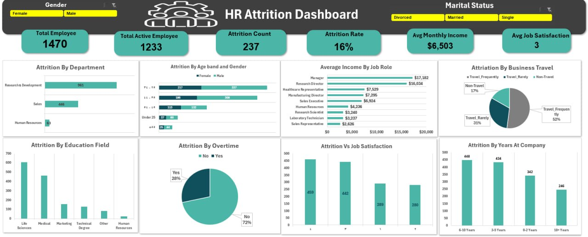

# 👥 Employee Attrition & Retention Analysis (HR Analytics)

## 1. 📊 Interactive Dashboard Preview

---

## 2. 📝 Executive Summary
This project delivers a comprehensive analysis of **Employee Turnover** within an organization of 1,470 employees. The primary goal is to leverage data-driven insights to identify the core drivers behind attrition and provide strategic recommendations to HR leaders to improve retention and minimize turnover costs.

### 📈 Key Performance Indicators (KPIs):
* **Workforce Size:** 1,470 Employees
* **Attrition Count:** 237 (Turnover Rate: **16%**)
* **Active Workforce:** 1,233 Employees
* **Avg Monthly Income:** $6,503
* **Retention Health:** 84%

---

## 3. 🔍 Deep-Dive Insights (Analytical Findings)

### A. Attrition by Workload & Travel (Burnout Factors)
* **The Travel Impact:** Employees who **Travel Frequently** represent **52%** of the attrition, marking high-frequency business travel as a major risk factor.
* **Overtime Pressure:** **28%** of the turnover comes from employees working overtime, suggesting that workload imbalance is directly linked to employee exits.

### B. Departmental & Role Vulnerability
* **High-Risk Roles:** **Sales Representatives** show the highest attrition rates, likely due to commission-based pressure and low base salary (Avg. $2.6k).
* **Departmental Stress:** The **R&D Department** houses the largest portion of the workforce but also sees significant numbers of employees leaving.

### C. Compensation & Job Satisfaction
* **Income Correlation:** There is a strong negative correlation between income and attrition; the lower the monthly income, the higher the likelihood of departure.
* **Cultural Health:** With an **Avg Job Satisfaction of 3/4**, there is an opportunity to improve organizational culture to retain top talent.

---

## 🛠️ 4. Data Methodology & Engineering
To ensure the highest standard of data integrity, I implemented the following:
* **Data Auditing:** Performed rigorous checks for missing values and outliers in compensation data.
* **Metric Engineering:** Calculated custom DAX-style measures in Excel to track **Attrition Rate** and **Active Headcount**.
* **Categorical Segmentation:** Grouped employees by Age Bands, Income Brackets, and Tenure to pinpoint specific "At-Risk" segments.
* **Visualization:** Engineered an interactive dashboard using **Advanced Pivot Tables & Slicers** for dynamic departmental filtering.

---

## 💡 5. Strategic Recommendations for HR
1. **Travel Policy Reform:** Implement flexible travel schedules for roles requiring frequent business trips to mitigate burnout.
2. **Compensation Review:** Target salary adjustments for entry-level roles (Sales & Lab Techs) to stay competitive with market rates.
3. **Engagement Initiatives:** Focus retention programs on employees with **5-10 years of tenure** to prevent mid-career "plateauing" and exits.

---

## 📂 Repository Structure
* `HR-Employee-Attrition.csv`: Cleaned HR dataset.
* `HR_Attrition_Dashboard.jpg`: Final dashboard visualization.
